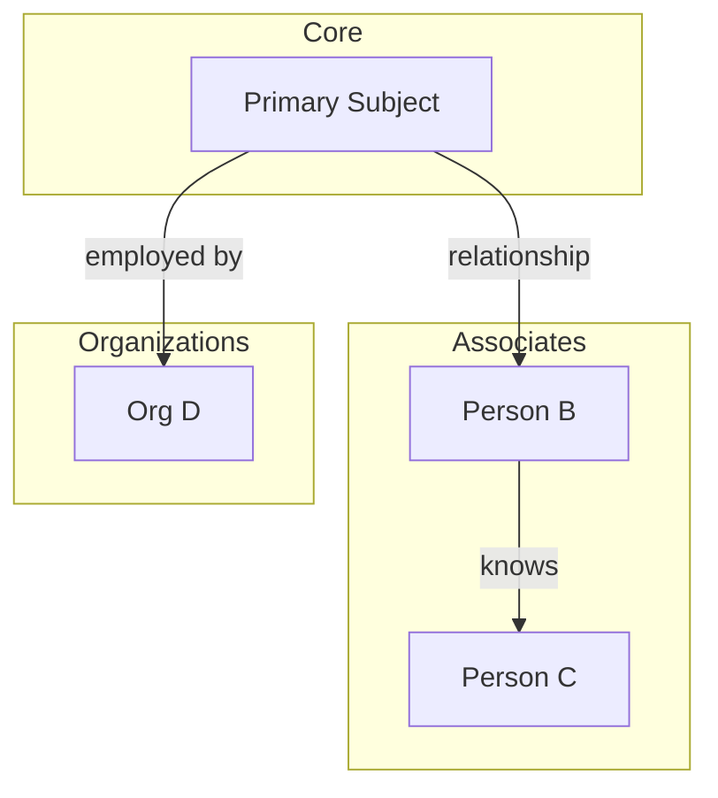

# Map Connections/Network

Analyze and visualize relationships between entities.

## Arguments

$ARGUMENTS - Optional: specific entity to map connections for

## Instructions

### 1. Review Existing Maps

Check `analysis/network-maps/` for existing relationship documentation.

### 2. Gather Connection Data

Collect relationship information from:
- Entity profiles in `analysis/entity-profiles/`
- Evidence showing connections
- Social media following/followers
- Organizational affiliations
- Communication patterns
- Shared activities or locations

### 3. Create/Update Network Map

Save to `analysis/network-maps/[focus-area].md`:

```markdown
# Network Map: [Subject/Focus Area]

**Last Updated**: [Date]
**Entities Mapped**: [Count]

---

## Visual Map



---

## Connection Matrix

| Entity 1 | Relationship | Entity 2 | Direction | Strength | Evidence |
|----------|--------------|----------|-----------|----------|----------|
| [Name] | [Type] | [Name] | Mutual/One-way | Strong/Moderate/Weak | [Link] |

---

## Relationship Types

- **Professional**: Employer/employee, colleague, business partner
- **Personal**: Family, friend, romantic
- **Online**: Follows, friend connection, mutual group
- **Financial**: Transaction, shared ownership, funding
- **Communication**: Email exchange, calls, messages

---

## Connection Strength Criteria

- **Strong**: Multiple touchpoints, frequent interaction, long history
- **Moderate**: Clear connection, some interaction evidence
- **Weak**: Single touchpoint, possible connection, unconfirmed

---

## Key Observations

[Analysis of network structure]
- Central nodes / hubs
- Clusters or groups
- Bridge connections
- Isolated entities
- Notable patterns

---

## Unconfirmed Connections

Potential relationships requiring verification:

| Entity 1 | Possible Relationship | Entity 2 | Basis for Suspicion |
|----------|----------------------|----------|---------------------|
```

### 4. Identify Patterns

Analyze for:
- Central figures (high connectivity)
- Gatekeepers (bridge between groups)
- Clusters or communities
- Isolated nodes
- Unexpected connections
- Missing expected connections

### 5. Integration

- Update entity profiles with newly discovered connections
- Note connections relevant to investigation objectives
- Identify entities that should be profiled based on network position
