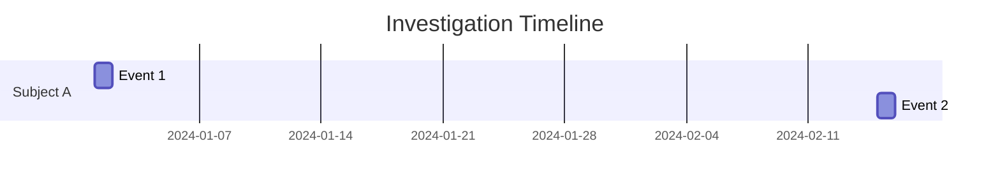

# Build/Update Timeline

Construct or update a chronological timeline of events.

## Arguments

$ARGUMENTS - Optional: specific subject or time period to focus on

## Instructions

### 1. Check Existing Timeline

Review `analysis/timeline/` for existing timeline work.

### 2. Gather Events

Collect dated events from:
- Entity profiles in `analysis/entity-profiles/`
- Evidence files in `evidence/`
- Notes and leads documentation
- Brief for known reference points

### 3. Create/Update Timeline

Save to `analysis/timeline/main-timeline.md` (or subject-specific file):

```markdown
# Investigation Timeline

**Subject**: [Investigation subject or specific focus]
**Last Updated**: [Date]
**Coverage**: [Date range]

---

## Timeline

| Date | Time | Event | Entity | Source | Confidence |
|------|------|-------|--------|--------|------------|
| YYYY-MM-DD | HH:MM | [What happened] | [Who/what] | [evidence/...] | High/Med/Low |

---

## Uncertain Dates

Events with approximate or uncertain timing:

| Approx. Date | Event | Reasoning | Source |
|--------------|-------|-----------|--------|
| ~YYYY-MM | [Event] | [Why uncertain] | [Source] |

---

## Date Notation

- Exact: `2024-01-15`
- Approximate: `~2024-01`
- Range: `2024-01 to 2024-03`
- Before: `<2024-06`
- After: `>2024-06`

---

## Gaps

Periods with no documented activity:
- [Date range]: [Why notable]

---

## Analysis Notes

[Observations about patterns, clusters of activity, etc.]
```

### 4. Identify Patterns

Look for:
- Clusters of activity
- Regular patterns (daily, weekly, etc.)
- Gaps that might be significant
- Correlations between entities
- Escalation or changes in behavior

### 5. Visual Timeline (Optional)

If helpful, create a Mermaid diagram:

```markdown

```

### 6. Cross-Reference

- Ensure timeline events link to evidence
- Update entity profiles with newly documented events
- Note any conflicting date information
