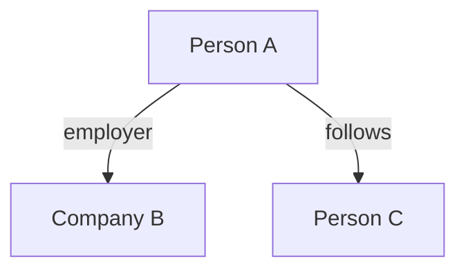

# Network Maps

Relationship and connection analysis between entities.

## For Claude

Document connections between people, organizations, accounts, etc.

Create network maps in Markdown using:
- Mermaid diagrams for visual relationships
- Tables for connection attributes
- Clear notation for connection type and strength

Example format:
```markdown
## Network: [Subject]



### Connections Table
| Entity 1 | Relationship | Entity 2 | Evidence | Confidence |
|----------|--------------|----------|----------|------------|
```

Note connection strength: confirmed, likely, possible, speculative.
